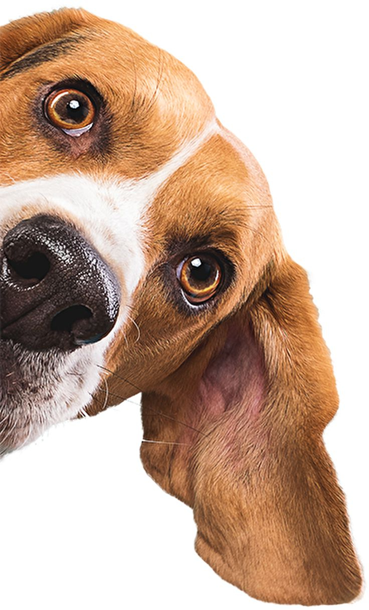

# 🐾 Luna Petshop

**Luna Petshop** é uma landing page moderna e responsiva desenvolvida com [React](https://react.dev/), [Vite](https://vitejs.dev/) e [Tailwind CSS](https://tailwindcss.com/). O objetivo do projeto é apresentar os serviços de um petshop de forma atrativa, funcional e profissional, facilitando o contato com clientes e destacando a identidade da marca.



---

## ✨ Tecnologias Utilizadas

- ⚛️ [React](https://react.dev/)
- ⚡ [Vite](https://vitejs.dev/)
- 🎨 [Tailwind CSS](https://tailwindcss.com/)
- ✅ [ESLint](https://eslint.org/) — padronização de código

---

## 🚀 Como Rodar o Projeto

Clone o repositório e siga os passos abaixo:

```bash
# Instalar dependências
npm install

# Iniciar servidor de desenvolvimento
npm run dev

🛠 Scripts Disponíveis
Comando	Função
npm run dev	Inicia o servidor de desenvolvimento 🚀
npm run build	Cria a versão de produção 📦
npm run preview	Visualiza a build localmente 🔍
npm run lint	Executa análise estática do código 🧹

📁 Estrutura de Pastas
css
Copiar
Editar
src/
├── App.jsx
├── Hero.jsx
├── main.jsx
├── index.css
├── assets/
│   ├── logo.png
│   ├── cachorro1.png
│   ├── Hero.jpeg
│   ├── pata1.png
│   ├── pata2.png
│   ├── pata3.png
│   └── pata4.png
public/
├── logo.png
└── vite.svg
📷 Imagens e Recursos
Todas as imagens estão organizadas na pasta src/assets.

O favicon foi personalizado com o logo do petshop (logo.png), referenciado no arquivo index.html.

🖼️ Logo Redondo
Para exibir o logo com bordas arredondadas, use a classe personalizada:

css
Copiar
Editar
.logo-redonda {
  border-radius: 50%;
}
Exemplo de uso:

jsx
Copiar
Editar

📱 Responsividade
O layout foi pensado para se adaptar perfeitamente a todos os dispositivos, com foco especial na experiência mobile. 🧩

📬 Contato via WhatsApp
O botão de WhatsApp está disponível no rodapé, facilitando o contato direto com o petshop de forma prática e eficiente. ✅

🧑‍💻 Autora
Feito com 💙 por Lidiane Santos — Desenvolvedora Front-End em transição de carreira com foco em criar experiências web modernas e atrativas.
